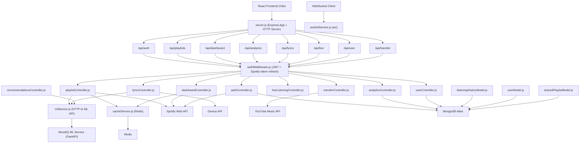

# MoodIQ — Backend

A Node.js REST API and WebSocket server that orchestrates Spotify OAuth, playlist intelligence, user data persistence, caching, and real-time live-listening sessions. It acts as the bridge between the React frontend, the Python ML service, and all third-party APIs.

---

## System Architecture



---

## Key Features

### 1. Spotify OAuth and Token Management
- Full OAuth 2.0 authorization code flow with redirect handling.
- Automatic Spotify access token refresh via `authMiddleware.js` on every protected request.
- JWT issuance (30-day expiry) after successful Spotify authentication.
- Middleware emits typed error codes (`JWT_EXPIRED`, `SPOTIFY_TOKEN_REFRESH_FAILED`) that the frontend interceptor maps to forced logout.

### 2. Playlist Intelligence
- Fetches user playlists and individual playlist tracks from Spotify.
- Retrieves audio features for all tracks in a playlist (batched Spotify API calls).
- Proxies mood analysis, flow optimization, gap detection, and mood generation requests to the ML service.
- Caches audio features and playlist metadata in Redis to avoid redundant Spotify API calls.

### 3. Dashboard and Now-Playing
- Polls Spotify for the currently playing track with full audio feature enrichment.
- Aggregates mood distribution, listening history, and top tracks from MongoDB.
- Returns a shareable playlist view that works without authentication.

### 4. Analytics
- Records every analyzed track to `listeningHistoryModel` in MongoDB.
- Computes mood timeline, mood distribution per day, and genre breakdowns from stored history.
- Exposes per-session and aggregate analytics endpoints consumed by the Realtime Analytics page.

### 5. Lyrics and Sentiment
- Fetches lyrics from the Genius API via web scraping with `cheerio`.
- Falls back to the Gemini API (via ML service) when Genius returns no results.
- Runs sentiment analysis on fetched lyrics and returns label plus confidence score.
- Supports Genius search for the in-app lyrics search bar.

### 6. Live Listening Sessions
- Creates and manages live listening sessions tied to the currently playing track.
- Auto-checks session state for inactivity using a timed endpoint.
- Stores session history for mood timeline continuity.

### 7. Recommendations and Feedback
- Proxies mood-filtered recommendation requests to the ML service.
- Records per-track user feedback (thumbs up/down) to `userModel` in MongoDB.
- Feedback is periodically used by the ML service to adjust personalisation weights.

### 8. Playlist Transfer
- Searches YouTube Music for each Spotify track by name and artist.
- Returns match results for the frontend TransferModal to confirm before saving.

### 9. WebSocket (Real-time)
- Initialises a `ws` WebSocket server on `/ws`.
- `socketService.js` manages client connections and broadcasts live session updates to connected frontend tabs.

### 10. Caching Layer
- Redis used for audio feature caching, playlist metadata caching, and rate limiting.
- Cache TTLs are defined per resource type. Redis failure is non-fatal — the server continues without caching.

---

## Technology Stack

| Component | Technology | Description |
| :--- | :--- | :--- |
| **Runtime** | Node.js (>=18), ES Modules | Server runtime |
| **Framework** | Express.js 4 | HTTP routing and middleware |
| **Database** | MongoDB (Mongoose 8) | User data, listening history, shared playlists |
| **Cache** | Redis 4 | Audio feature cache, session cache, rate limiting |
| **WebSockets** | ws 8 | Real-time live-listening session broadcasts |
| **Auth** | jsonwebtoken 9 | JWT issuance and validation |
| **Spotify** | spotify-web-api-node 5 | Spotify API client |
| **Lyrics Scraping** | cheerio 1 | HTML parsing for Genius lyrics pages |
| **HTTP Client** | Axios 1 | Requests to ML service and external APIs |
| **YouTube Music** | googleapis 129 | YouTube Music search for playlist transfer |

---

## Project Structure

```
Backend/
├── controllers/
│   ├── authController.js          # Spotify OAuth, JWT issuance, user creation
│   ├── playlistController.js      # Playlist fetching, audio features, ML proxying
│   ├── dashboardController.js     # Now-playing, history, mood distribution
│   ├── analyticsController.js     # Mood timeline, aggregate stats, history writes
│   ├── lyricsController.js        # Genius scraping, sentiment, Genius search
│   ├── liveListeningController.js # Live session start/end/auto-check
│   ├── recommendationsController.js # Mood-filtered recommendations, feedback
│   ├── transferController.js      # YouTube Music playlist transfer
│   └── userController.js          # User preferences, feedback, personalization
├── middleware/
│   └── authMiddleware.js          # JWT verification + Spotify token auto-refresh
├── models/
│   ├── userModel.js               # User profile, preferences, feedback history
│   ├── listeningHistoryModel.js   # Per-track listening records
│   └── sharedPlaylistModel.js     # Shareable playlist snapshots
├── routes/
│   ├── authRoutes.js
│   ├── playlistRoutes.js
│   ├── dashboardRoutes.js
│   ├── analyticsRoutes.js
│   ├── lyricsRoutes.js
│   ├── liveListeningRoutes.js
│   ├── userRoutes.js
│   └── transferRoutes.js
├── services/
│   ├── mlService.js               # HTTP client for MoodIQ ML service
│   ├── cacheService.js            # Redis connection and cache helpers
│   └── socketService.js           # WebSocket server management
├── utils/
│   └── constants.js               # Shared constant values
├── server.js                      # App entry point, route registration, startup
└── package.json
```

---

## Getting Started

### Prerequisites

- Node.js v18 or later
- MongoDB Atlas cluster (or local MongoDB)
- Redis instance (optional but recommended)
- Spotify Developer application with a registered redirect URI
- Running instance of the MoodIQ ML Service

### Step 1: Environment Setup

```bash
cp .env.development .env
```

Fill in the following variables:

| Variable | Description |
| :--- | :--- |
| `MONGO_URI` | MongoDB connection string (e.g. `mongodb+srv://...`) |
| `JWT_SECRET` | Secret key for signing JWTs |
| `JWT_EXPIRES_IN` | JWT expiry duration (e.g. `30d`) |
| `SPOTIFY_CLIENT_ID` | Spotify application client ID |
| `SPOTIFY_CLIENT_SECRET` | Spotify application client secret |
| `SPOTIFY_REDIRECT_URI` | OAuth callback URL registered in Spotify Developer Dashboard |
| `FRONTEND_URL` | URL of the deployed frontend (for CORS and redirects) |
| `ML_API_URL` | Base URL of the MoodIQ ML service |
| `REDIS_URL` | Redis connection URL (optional) |
| `ENABLE_CACHE` | Set to `true` to enable Redis caching |
| `NODE_ENV` | `development` or `production` |
| `GENIUS_ACCESS_TOKEN` | Genius API token for lyrics fetching |

### Step 2: Install Dependencies

```bash
npm install
```

### Step 3: Run the Development Server

```bash
npm run dev
```

The server starts on `http://localhost:3000` by default.

### Step 4: Production Start

```bash
npm start
```

---

## API Endpoints

| Route | Description |
| :--- | :--- |
| `GET /health` | Service health check (backend, MongoDB, ML service status) |
| `GET /api/auth/login` | Initiates Spotify OAuth flow |
| `GET /api/auth/callback` | Spotify OAuth redirect handler |
| `GET /api/auth/me` | Returns authenticated user profile |
| `GET /api/playlists` | Returns user's Spotify playlists |
| `GET /api/playlists/:id` | Returns tracks and audio features for a playlist |
| `POST /api/playlists/analyze` | Runs mood analysis on a playlist via ML service |
| `POST /api/playlists/optimize` | Returns optimised track order for smooth mood flow |
| `POST /api/playlists/fill-gaps` | Returns bridge tracks to fill detected mood gaps |
| `POST /api/playlists/generate` | Generates a mood/activity-based playlist |
| `GET /api/dashboard/now-playing` | Currently playing track with mood and audio features |
| `GET /api/analytics/timeline` | Mood timeline from listening history |
| `GET /api/lyrics/:trackId` | Fetches lyrics (Genius with Gemini fallback) |
| `POST /api/lyrics/analyze` | Runs sentiment analysis on a set of tracks |
| `GET /api/lyrics/search` | Searches Genius for a song |
| `POST /api/live/session/start` | Starts a live listening session |
| `GET /api/live/session/current` | Returns current live session state |
| `POST /api/user/feedback` | Records thumbs up/down feedback for a track |
| `POST /api/transfer` | Transfers a Spotify playlist to YouTube Music |

---

## License

This project is licensed under the [MIT License](LICENSE).
